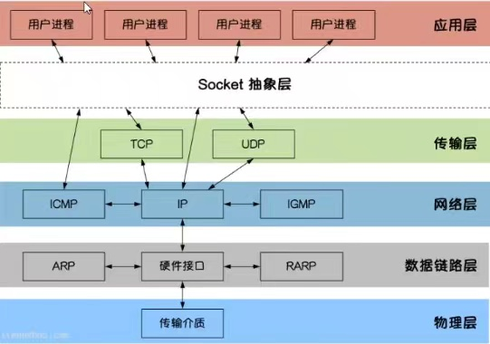

# 网络编程

### 五层模型：
#### 物理层
- 电脑与外界互联网通信，需要先把电脑链接网络，用一些物理手段（双绞线、光纤、无线电波等）连起来。
- 这一层主要规定了一些电气特性，作用是负责传送0或1的电信号
#### 数据链路层
- 加Ethernet协议头，协议头包含网卡地址(MAC地址)
- Frame帧：一组电信号构成一个数据包，叫做帧
- 每一帧分成两部分：head + data
- head为固定18字节，data最短46字节(整个帧最短为64字节)，最长1518字节
- 如果数据很长，就必须分割成多个帧进行发送
- 通过ARP协议获取接收方的MAC地址
- 以太网发送数据的方式很“原始”，它会向本网络内所有计算机都发送，让每台计算机都读取到这个包的“标头”，找到接收方的MAC地址，然后与自身的MAC地址相比较，如果两者相同，就接收这个包，做进一步处理，否则就丢弃这个包。这种发送方式叫做“广播(broadcasting)”。
- 只依靠MAC地址只能实现两台在同一子网络的计算机收发数据，因此需要一种方法区分是内网传输还是外网传输。
#### 网络层
- 加IP协议头，协议头包含IP地址
- 如果是同一子网络，就用广播方式发送；否则，用路由方式发送
- 网络地址是网络管理员分配的，网络地址可以确定计算机所在的子网络，MAC地址将数据包送到该子网络中的目标网卡。顺序：先处理网络地址，再处理MAC地址。
- 规定网络地址的协议，叫做**IP协议**，它所定义的地址，就是**IP地址**
- IP数据包 = head + data, 整个数据包的总长度最大为65535字节
    - head: 包括版本、长度、IP地址等信息。长度20~60bytes
    - data: IP数据包的具体内容
#### 传输层
- 加port端口号到header
- 同一台主机有很多程序需要用网络收发数据，需要一个参数，表示包要送到哪个程序里，这个参数叫做**端口**
- 端口是每一个使用网卡的程序的编号
- 合法端口号：0~65535(16 bits)
- 端口号0~1023被系统占用，用户只能选大于1023的端口号
- 协议：UDP、TCP
    - UDP：比较简单，容易实现；可靠性较差，数据包发出后，不确定对方能否收到。用途：直播
    - TCP：确保数据不会遗失；过程复杂，实现困难，消耗较多的资源。用途：网站，即时聊天
- TCP包没有长度限制，理论上可以无线插个，但是为了保证网络效率，通常TCP数据包的长度不会超过IP数据包的长度，以确保单个TCP数据包不必再分割。
#### 应用层
- 作用：规定应用程序使用的数据格式，比如：TCP协议之上常见的Email、FTP、HTTP等

### Socket
Socket是BSD UNIX的进程通信机制，通常也叫做“套接字”。
- Socket用于描述IP地址和端口，是一个通信链的句柄。
- Socket可以理解为TCP/IP网络的API，它定义了许多函数或例程，程序员可以用它们来开发TCP/IP网络上的应用程序。
- 电脑上运行的应用程序通常通过“套接字”向网络发出请求或者应答网络请求。
- Socket是应用层与TCP/IP协议族通信的中间软件抽象层。
- 在设计模式中，Socket把复杂的TCP/IP协议族隐藏在Socket后面，对用户来说只需要调用Socket规定的相关函数，让Socket去组织符合指定的协议数据，然后进行通信。

### TCP协议
- TCP/IP (Transmission Control Protocol/Internet Protocol)即传输控制协议/网络协议
- 是一种面向连接的、可靠的、基于字节流的传输层(Transport Layer)通信协议
- 因为是面向连接的协议，数据像水流一样传输，会存在粘包问题

##### 为什么会出现粘包？
主要原因：TCP数据传输模式是流模式，在保持长连接的时候可以进行多次的收发

##### 粘包何时出现？
- **由Nagle算法造成的发送端的粘包**：Nagle算法是一种改善网络传输效率的算法。当提交一段数据给TCP发送时，TCP并不立刻发送此段数据，而是等待一小段时间看看在等待期间是否还有要发送的数据，若有则会一次把这两段数据发送出去
- **接收端接收不及时造成的接收端粘包**：TCP会把接收到的数据存在自己的缓冲区中，然后通知应用层取数据。当应用层由于某些原因不能及时把TCP的数据取出来，就会造成TCP缓冲区中存放了几段数据。

##### 解决粘包问题
- 出现粘包的关键在于接收方不确定将要传输的数据包的大小，因此我们可以对数据包进行封包和拆包的操作
- 封包就是给一段数据加上包头，数据包=包头+包体。过滤非法包时封包会加入包尾内容
  - 包头长度是固定的，并且存储了包体的长度
  - 根据包头长度固定以及包头中含有包体长度的变量就能正确拆分出一个完整的数据包
    代码：https://github.com/lcymq/tcp_server

### UDP
- UDP(User Domain Protocol)，用户数据包协议
- UDP是OSI(Open System Interconnection 开放式系统互联)参考模型中一种无连接的传输层协议
- 不需要建立连接就能直接发送和接收数据，属于不可靠的、没有时序的通信
- 但是UDP协议的实时性比较好，通常用于视频直播相关领域