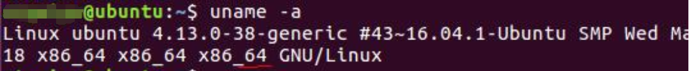

# Ubuntu中安装配置golang

### SDK版本说明

- 32位系统：go1.17.1.linux-386.tar.gz
- 64位系统：go1.17.1.linux-amd64.tar.gz

如何确认linux是多少位：`uname -a`



注意：安装目录不要有中文或者特殊符号如空格等

SDK安装目录建议：linux放在/opt目录下


### 安装步骤

1. 将`go1.17.1.linux-amd64.tar.gz` 复制到`/opt`下

   ```shell
   cp go1.17.1.linux-amd64.tar.gz /opt
   ```

2. `cd /opt`

3. 解压：`tar -zxvf go1.17.1.linux-amd64.tar.gz`

4. `cd go/bin`

5. `./go version`


### 配置环境变量

1. 使用root权限来编辑 `vim /etc/profile` 文件

2. 添加以下语句到profil文件的最后：

   ```shell
   export GOROOT=/opt/go
   export PATH=$PATH:$GOROOT/bin
   export GOPATH=$HOME/goproject
   ```

3. 重启以使新添加的环境变量生效

4. 测试是否安装成功：`go version` 

