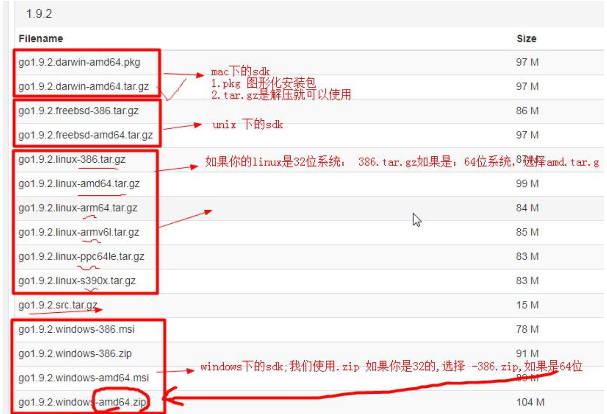
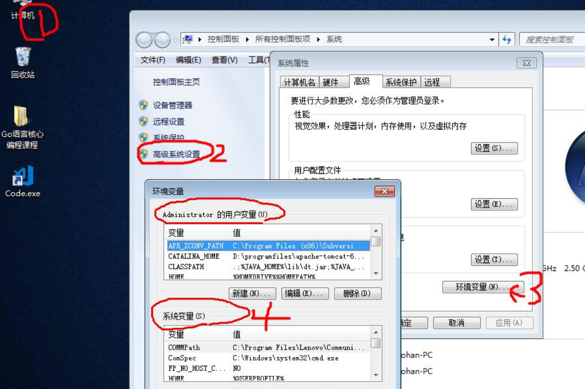
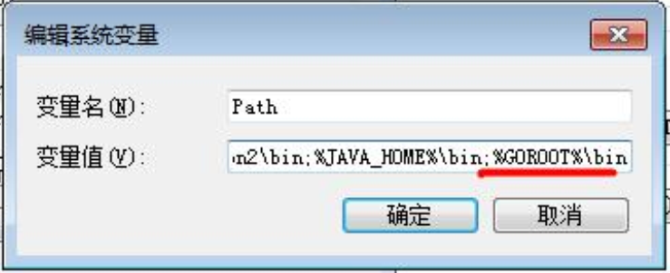

# win10中安装配置golang

### SDK

- SDK的全称(Software Development Kit 软件开发工具包)
- SDK是提供给开发人员使用的，其中包含了对应开发语言的工具包

### 下载SDK工具包

- go语言的官网：golang.org，因为各种原因，可能无法访问

- SDK下载地址：

  - 国外：https://golang.org/dl/
  - 国内：https://www.golangtc.com/download

- 选择对应的sdk版本：

  

### 安装SDK

- 版本
  - 32位：386
  - 64位：amd64
- 注意事项
  - 安装路径不要有中文或者特殊符号如空格等

### 解压后的go目录


###### bin目录


###### 测试go的SDK安装成功


### 配置golang环境变量

- 为什么配置环境变量？

  - 执行的程序在当前目录下不存在，windows系统会在系统中已有的一个名为path的环境变量指定的目录中查找。若仍未找到，会出现以下的错误提示：

    

- 根据windows系统在查找可执行程序的原理，可以将go所在路径定义到环境变量中，让系统去找运行执行的程序，这样的任何目录下都可以执行go指令。

- go开发中，需要配置的环境变量

  | 环境变量 | 说明                             |
  | -------- | -------------------------------- |
  | GOROOT   | 指定SDK的安装路径 d:/programs/go |
  | Path     | 添加SDK的/bin目录                |
  | GOPATH   | 工作目录，go项目的工作路径       |

##### 步骤

1. 打开环境变量配置界面

   

2. 配置环境变量

   系统变量 -> 新建

   

3. 编辑系统变量Path

   

   增加go的bin：`;%GOROOT%\bin`

4. 系统变量 -> 新建 -> `GOPATH`（GOPATH是以后go项目存放的路径，即工作目录）

   

5. 测试环境变量是否配置成功

   

   注意：配置环境变量后，需要重新打开一次dos的终端，这样环境变量才会生效。

### 编译
使用`go build`
1. 在项目目录下执行`go build`
2. 在其他路径下执行`go build`，需要在后面加上项目的路径(项目路径从GOPATH/src后开始写起)
3. 生成不与源代码文件名字一样的可执行文件：`go build -o 新文件名.exe`
4. `go install`: 先编译得到一个可执行文件，再将可执行文件复制到`GOPATH/bin`

### 跨平台编译
只需要执行目标操作系统的平台和处理器架构即可：

Windows下编译Linux平台64位可执行程序
```cmd
SET CGO_ENABLED=0 // 禁用CGO
SET GOOS=linux // 目标平台是linux
SET GOARCH=amd64 //目标处理器架构是amd64
go build
```

Windows下编译Mac平台64位可执行程序：
```cmd
SET CGO_ENABLED=0
SET GOOS=darwin
SET GOARCH=amd64
go build
```

Mac下编译Linux和Windows平台64位可执行程序：
```shell
CGO_ENABLED=0 GOOS=linux GOARCH=amd64 go build
CGO_ENABLED=0 GOOS=windows GOARCH=amd64 go build
```

Linux下编译Mac平台64位可执行程序：
```shell
CGO_ENABLED=0 GOOS=darwin GOARCH=amd64 go build
CGO_ENSBLED=0 GOOD=windows GOARCH=amd64 go build
```