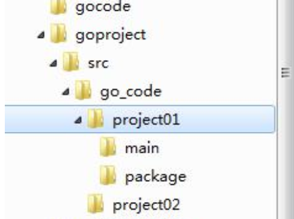
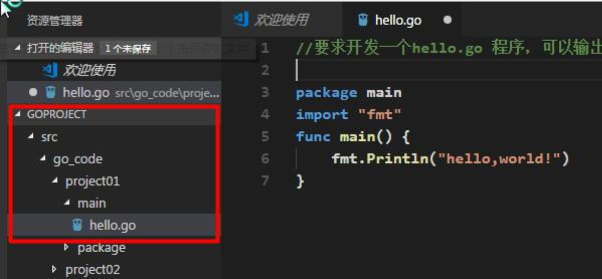
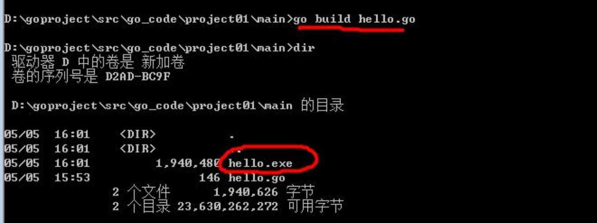
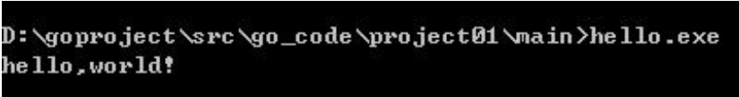
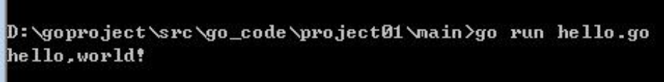

# 开发编译运行的步骤

### 需求

要求开发一个`hello.go`程序，可以输出“hello world”

### 开发的步骤

###### 1. go的目录结构

- go文件的后缀是`.go`
- package main - 表示该`hello.go`文件所在的包是`main`，在go中，每个文件都必须归属于一个包。
- `import “fmt”`
  - 表示：引入一个包，包名为`fmt`，引入该包后，就可以使用`fmt`包的函数，比如：`fmt.Println`
- `func main(){}`
  - `func`是一个关键字，表示一个函数
  - `main`是函数名，是一个主函数，即我们程序的入口。
- `fmt.Println("hello")`
  - 表示调用`fmt`包的函数`Println`输出“hello world”

###### 2. 编译

- 通过`go build`命令对该go文件进行编译，生成`.exe`文件

  

- 运行`hello.exe`文件即可

  

- 注意：通过`go run`命令可以直接运行`hello.go`程序 [类似执行一个脚本文件的形式]

  

  